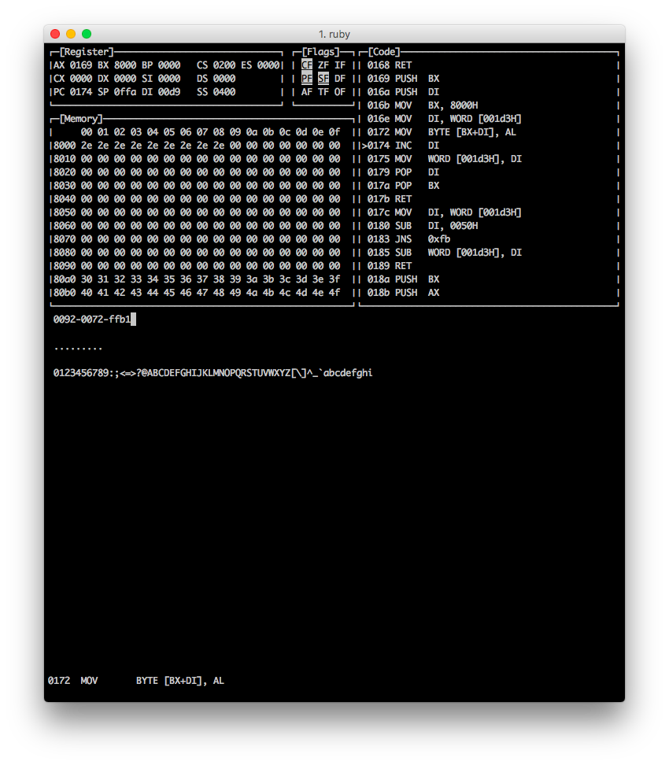

# 8086 emulator

8086 emulator written in Ruby

## Screenshot

### usage

> $ ./console.rb

start code console and load `codegolf.8086`

 - `s` call step run
 - `p` call run until breakpoint
 - `r` call reset status export breakpoint infomation
 - `:` call `ruby` eval
 - `i` call `irb` repl
 - `qq` exit console

### ruby command

 - `@bp` breakpoint array
    - `@bp << newpoint_offset` add a new point to breakpoint list
 - `@cl` current operation times
 - `@bpl` break on `@cl == @bpl`
 - `@s` sleep time between two step when using __run until__ mode
 - `@ms` memory screen start address
    - `@ms = 0x8000` and now the screen show memory from 0x8000 to 0x80b0
 - `@cpu` core class instance
